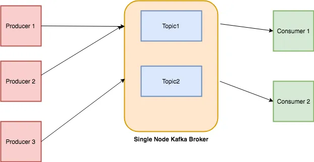

## Single Node Kafka Broker

## What is Kafka?

**Definition:**
The Kafka is an events streaming platform. Events, or messages, represent the actual data that is exchanged through Kafka. It is arguably the most popular messaging platform in the world. In Kafka's world, there are data publishers called producers which push messages into Kafka. And there are subscribers called consumers which listen and receive the messages.

**Capabilities Kafka provide for Data Exchange:**
- It collects messages from multiple producers concurrently. 
- It provides persistent storage of the messages received. 
- This provides fault-tolerance capabilities. 
- It transports data across from the producers to the consumers. 
- With mirroring capabilities, it can also transport across networks. 
- It distributes data to multiple concurrent consumers for downstream processing. 
- Finally, it provides tracking of message consumption by each consumer. This ensures at least one's delivery of the messages, even if the consumers go down and come back again. 

## What is Broker?

A Kafka broker is a single Kafka server or instance running in a Kafka cluster. Brokers are responsible for handling and managing the storage, processing, and distribution of data (messages) within Kafka topics.

- The Kafka broker receives messages from producers and stores them locally in logs. 
- Consumers subscribe to specific topics within the Kafka broker. 
- The broker keeps track of all the active consumers. 
- It knows about the last message that was sent to the consumer, so it only sends new messages in the subscribed topics to that consumer. 
- It also keeps a heartbeat with every consumer so when a consumer dies, it can track and reset. 
Kafka brokers manage the lifecycle of topics. 

## What is Topic?
A topic in Kafka is an entity that holds messages. It's similar to a file that contains papers where the messages represent the papers. It's similar to a database table that contains records where the messages represent the records. Topics can be considered as a queue for similar messages. 

- Each topic supports multiple producers to publish data to the topic concurrently
- Similarly, multiple consumers can consume data from the topic.

## Kafka Producer:
A Kafka producer is responsible for publishing data to Kafka topics. It sends messages to specific topics within the Kafka cluster. Producers write data to topics that are then made available to consumers. Producers can send messages synchronously or asynchronously, and they specify the topic to which they are producing messages.

## Kafka Consumer:
A Kafka consumer reads messages from Kafka topics. Consumers subscribe to specific topics to receive messages published to those topics by producers. They can read messages at their own pace, and they can be part of a consumer group where multiple consumers collectively consume messages from a topic, ensuring load balancing and fault tolerance.