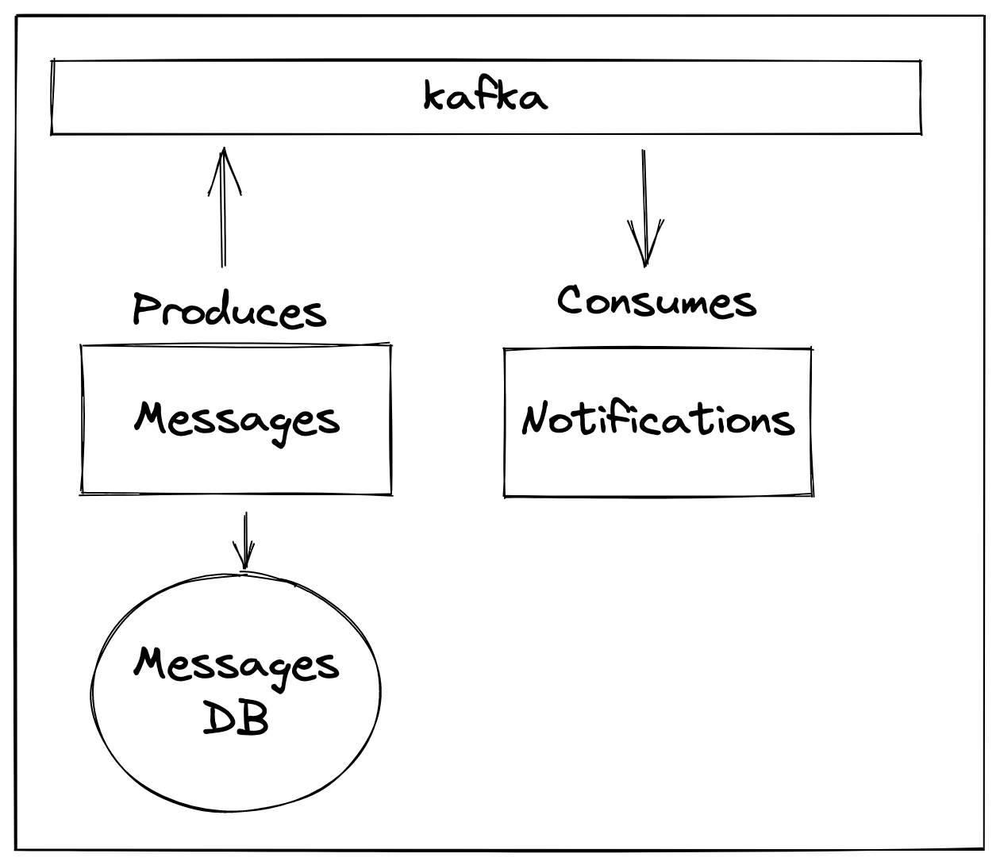

## What is Kafka?


Kafka is an event streaming platform which you can use to build event driven systems. So you can have producer which produce events and you can have compltely seprate application which are able to consume these events by reading them from Kafka. Kafka has the notion of topics, this is kind of different categories of events. So you can have producer that will write to a topic and then you can have a consumer that will read events from that topic.

Definition:
The Kafka is an events streaming platform. Events, or messages, represent the actual data that is exchanged through Kafka. It is arguably the most popular messaging platform in the world. In Kafka's world, there are data publishers called producers which push messages into Kafka. And there are subscribers called consumers which listen and receive the messages.
Capabilities Kafka provide for Data Exchange:
It collects messages from multiple producers concurrently. 
It provides persistent storage of the messages received. 
This provides fault-tolerance capabilities. 
It transports data across from the producers to the consumers. 
With mirroring capabilities, it can also transport across networks. 
It distributes data to multiple concurrent consumers for downstream processing. 
Finally, it provides tracking of message consumption by each consumer. 
This ensures at least one's delivery of the messages, even if the consumers go down and come back again. 


## What is Zookeeper?


## [Kafka with zookeeper and kafkadrop](https://www.red-gate.com/simple-talk/development/dotnet-development/setting-up-a-kafka-test-environment-with-kafdrop/)

## Steps
Step 1: Run Kafka
```
docker-compose up
```
Step 2: Create topics
```
docker exec -it kafka /opt/bitnami/kafka/bin/kafka-topics.sh --create --bootstrap-server localhost:9092 --replication-factor 1 --partitions 1 --topic test
```

* If you use this kind of syntax `const import x from '<x-package>'` then use `"type": "module"` in `package.json`.

## Packages used
1. node-rdkafka
The node-rdkafka library is a high-performance NodeJS client for Apache Kafka that wraps the native librdkafka library. 
2. Avsc
Pure JavaScript implementation of the Avro specification. Blazingly fast and compact serialization! Typically faster than JSON with much smaller encodings.

## What is Avro?
Avro facilitates the exchange of big data between programs written in any language. With the serialization service, programs can efficiently serialize data into files or into messages. The data storage is compact and efficient. Avro stores both the data definition and the data together in one message or file.

Avro stores the data definition in JSON format making it easy to read and interpret; the data itself is stored in binary format making it compact and efficient. 

# Building event-driven systems with kafka

https://www.youtube.com/watch?v=6-1N8wIZ1ic&ab_channel=TomDoesTech

## What are we building?
* A simple event-driven system that will allow us to send messages to kafka and then consume them

b


## Why Kafka?
* Kafka is a distributed streaming platform
* It is horizontally scalable
* It is fault tolerant
* It is fast
* It is used by many companies including Uber, Netflix, LinkedIn, and many more

## Kafka terms and definitions
* **Producer** - A producer is a client that sends messages to a topic on the Kafka cluster

* **Consumer** - A consumer is a client that reads messages from a topic on the Kafka cluster

* **Topic** - 
A topic in Kafka is an entity that holds messages. It's similar to a file that contains papers where the messages represent the papers. It's similar to a database table that contains records where the messages represent the records. Topics can be considered as a queue for similar messages. 

Each topic supports multiple producers to publish data to the topic concurrently
Similarly, multiple consumers can consume data from the topic.


Each topic has multiple partitions that physically split data across multiple files.

So technically, a topic can contain all kinds of messages with different formats, but in practice, they are used to hold similar messages. What does similar mean in this case? Usually, the structure of the messages are identical and have the same set of producers and consumers. Examples of topics include sales transactions, audit logs, video files, et cetera. Kafka supports multiple topics per Kafka instance so topics can be created based on specific use cases and multiple application domains can create topics in the same Kafka instance. Each topic supports multiple producers to publish data to the topic concurrently. Similarly, multiple consumers can consume data from the topic. Each topic has multiple partitions that physically split data across multiple files. Here is an example of how topics exist in Kafka. In this case, we have one Kafka instance with two topics: orders and logs. The orders topic has three partitions: P1, P2, and P3. There are eight messages in the topic from M1 to M8. The messages are distributed across the three partitions. Each message will be stored in only one partition. Similarly, the logs topic has two partitions and six messages. We will discuss partitions in detail later in the course. In the next video, let's discuss Kafka brokers.

* **Broker**

A Kafka broker is a single Kafka server or instance running in a Kafka cluster. Brokers are responsible for handling and managing the storage, processing, and distribution of data (messages) within Kafka topics.

The Kafka broker receives messages from producers and stores them locally in logs. 
Consumers subscribe to specific topics within the Kafka broker. 
The broker keeps track of all the active consumers. 
It knows about the last message that was sent to the consumer, so it only sends new messages in the subscribed topics to that consumer. 
It also keeps a heartbeat with every consumer so when a consumer dies, it can track and reset. 
Kafka brokers manage the lifecycle of topics. 


They track and manage topic partitions. They also manage the corresponding partition logs. Multiple Kafka brokers can be clustered together to form a single Kafka cluster. Within a Kafka cluster, there is one Kafka broker instance that will act as the active controller for the cluster. In addition, each partition will have a corresponding Kafka broker as its leader. The leader then manages the specific partition. A Kafka broker also takes care of replicating topic partitions across multiple brokers, so even if one broker goes down the other brokers can take over the corresponding topic partitions. This provides fall tolerance for Kafka. In the next video, let's explore Kafka logs.

* **Partition** - A partition is an ordered, immutable sequence of records that is continually appended to a file. The records in the partitions are each assigned a sequential id number called the offset that uniquely identifies each record within the partition.

* **Replication** - Replication is the process of duplicating data across multiple brokers. Replication provides fault tolerance and high availability. A topic can have multiple partitions, and each partition can have multiple replicas.

* **Consumer Group** - A consumer group is a group of consumers that cooperate to consume messages from a set of topics. Each consumer in a group can process the messages in parallel. The Kafka cluster ensures that each message is delivered to one consumer in each subscribing consumer group.

* **Offset** - The offset is a unique identifier for a message within a partition. The offset is assigned when a producer publishes a message to a partition. The offset is used by the consumer to determine the message to process next.

* **Leader** - The leader is the server that is currently the active controller for a partition. The leader handles all read and write requests for the partition. Only the leader can become a follower.

* **Follower** - The follower is a passive server that replicates the log of the leader. The follower can become the leader if the current leader fails.